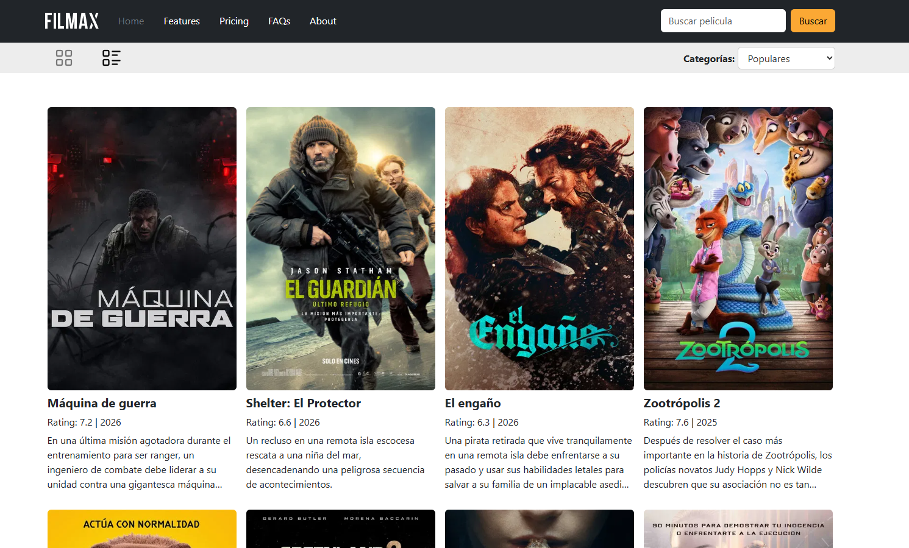
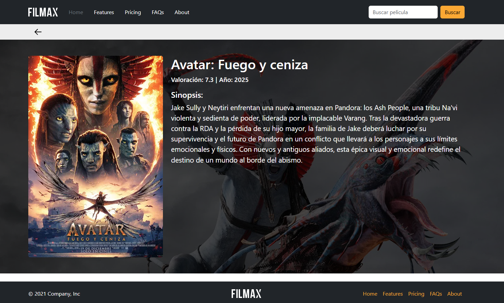

# FILMAX

FILMAX is a frontend movie browsing application built with vanilla JavaScript, Vite, Bootstrap, and the TMDB API. The project focuses on delivering a clean browsing experience for movie discovery while demonstrating solid component organization, API integration, and DOM-driven rendering without changing the current product behavior.

## Key Features

- Browse movie collections by category: now playing, popular, top rated, and upcoming
- Switch between grid and list layouts from the main view
- Open a dedicated movie detail view with poster, backdrop, rating, release year, and overview
- Fetch live movie data from the TMDB API
- Keep a lightweight frontend architecture based on reusable modules and utility functions

## Tech Stack

- JavaScript (ES modules)
- Vite
- Bootstrap 5
- Sass
- TMDB API

## Project Structure

```text
.
|-- docs/
|   |-- home.png
|   `-- detail.png
|-- public/
|   |-- grid-layout.svg
|   |-- left-arrow.svg
|   |-- list-layout.svg
|   `-- logo.png
|-- src/
|   |-- components/
|   |   |-- movie-detail/
|   |   |-- movie-list/
|   |   `-- secondary-nav/
|   |-- config/
|   |-- scss/
|   |-- utils/
|   |-- index.html
|   `-- main.js
|-- .env.example
|-- package.json
`-- vite.config.js
```

## Installation and Local Setup

1. Clone the repository:

```bash
git clone https://github.com/Tonruy/b16-mod3-js-advanced-practice.git
cd b16-mod3-js-advanced-practice
```

2. Install dependencies:

```bash
npm install
```

3. Create a local environment file from the example and add your TMDB API key:

```bash
copy .env.example .env
```

Update `.env` with:

```env
VITE_TMDB_API_KEY=your_tmdb_api_key_here
```

4. Start the development server:

```bash
npm run dev
```

5. Create a production build:

```bash
npm run build
```

## What This Project Demonstrates

- Integration with an external REST API in a frontend-only application
- State handling for category and layout changes using modular JavaScript
- Dynamic rendering for list, grid, and detail views
- Clear separation between configuration, utilities, UI components, and styles
- Practical use of Vite for local development and production builds

## Screenshots

<table align="center" width="800">
  <tr>
    <td align="center"><strong>HOME</strong></td>
    <td align="center"><strong>DETAIL</strong></td>
  </tr>
  <tr>
    <td align="center">
      
    </td>
    <td align="center">
      
    </td>
  </tr>
</table>

## Author

Antonio Ruiz  
GitHub: [Tonruy](https://github.com/Tonruy)
